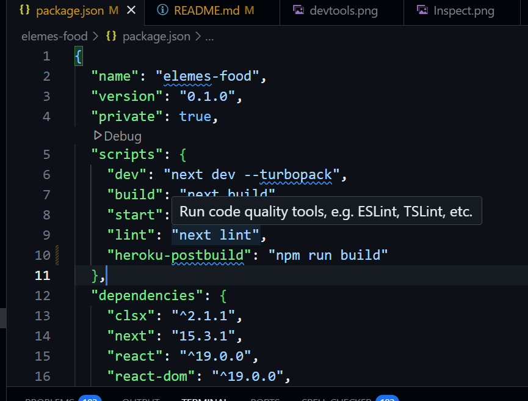

# Elemes-Food

Aplikasi elemes-food rating makanan menyediakan tampilan interaktif dengan beberapa warna 
yang tampil dengan interaksi visual antar user untuk menyediakan nuansa positif design.

### **Fitur Utama:**
- Fitur 1: Menampilkan Beberapa makanan dengan rating tinggi menggunakan fitur rekomendasi.
- Fitur 2: Mencari Kategori makanan dari berbagai jenis untuk mendapatkan makanan dengan slera yang diginkan.

### **Link Aplikasi**
- Vercel-> https://elemes-teknikal-ihrat-pramudya-crso.vercel.app/

---

## **Prasyarat**

Sebelum menjalankan proyek ini, pastikan Anda sudah menginstal perangkat berikut:

- **Node.js** - [Instalasi Node.js](https://nodejs.org/)
- **NPM** - (NPM sudah termasuk dalam instalasi Node.js)
- **NexJs** - Jika menggunakan 

---

## **Instalasi**

Langkah-langkah untuk menginstal proyek ini di komputer lokal Anda:

1. **Clone repositori ke mesin lokal:**

    ```bash
    git clone https://github.com/IhratPramudya/elemes-teknikal-interview.git
    cd repository-name
    ```

2. **Instal dependensi:**

    Jika Anda menggunakan **npm**:
    ```bash
    npm install
    ```


3. **Menjalankan Proyek:**

    Setelah berhasil menginstal semua dependensi, jalankan proyek dengan perintah berikut:

    Jika Anda menggunakan **npm**:
    ```bash
    npm start
    ```

    Jika ingin menjalankan mode development **npm**:
    ```bash
    npm run dev
    ```

---

## **Penggunaan**

Deskripsikan bagaimana cara menggunakan aplikasi atau program ini setelah instalasi selesai.

Contoh penggunaan atau demonstrasi aplikasi:

1. **Buka aplikasi:** Di browser Anda, buka alamat lokal atau port yang sesuai seperti `http://localhost:3000`.
2. **Langkah-langkah penggunaannya:** Cara melihat responsive aplikasi web yaitu pertama klik kanan dan memilih inspect.

### **U**


3. Kemudian kita buka icon berbentuk hp dan mulai memilih ukuran layar yang ingin digunakan.


## **Teknologi yang Digunakan**

Sebutkan teknologi yang digunakan dalam proyek ini.

- **React.js** - Untuk membangun antarmuka pengguna.
- **Node.js** - Untuk menjalankan backend.
- **TailwindCSS** - Untuk styling frontend.
- **NextJs** - Sebagai basis data.

---

## **Gambar**


### **Mendeploy aplikasi elemes-food kedalam heroku**

1. Tambahkan Script -p $PORT dan  "heroku-postbuild" di dalam package-json.
2. Lihat seprti gambar di bawah ini:



3. kemudian buat repository Github dengan nama yang diginkan kemudian tekan tombol "create repository"


4. Lanjutkan dengan langkah penggunaan git di lokal komputer jika git sudah terpasang di lokal komputer


# Penggunaan Git di Lokal Komputer

Berikut adalah langkah-langkah untuk **menginisialisasi Git** di proyek lokal Anda dan menghubungkannya dengan **repositori GitHub**.

### 1. **Inisialisasi Git dalam Folder Proyek Lokal Anda**
Untuk memulai, buka terminal di dalam folder proyek Anda, kemudian jalankan perintah berikut untuk **menginisialisasi repositori Git** di folder tersebut:
```bash
git init
```

### 2. **Salin URL Repositori GitHub Anda**
Setelah repositori GitHub Anda dibuat, salin URL repositori tersebut (misalnya: `https://github.com/username/my-project.git`).

### 3. **Menambahkan Remote Repository**
Kemudian, sambungkan repositori lokal Anda dengan repositori GitHub menggunakan perintah berikut:
```bash
git remote add origin https://github.com/username/my-project.git
```
Gantilah `https://github.com/username/my-project.git` dengan URL repositori GitHub Anda.

### 4. **Menambahkan File ke Staging Area**
Setelah Git terinisialisasi dan remote repository ditambahkan, Anda perlu menambahkan file proyek Anda ke **staging area** agar Git tahu file mana yang akan di-commit:
```bash
git add .
```
Perintah ini akan menambahkan **semua file** di folder proyek ke staging area. Jika Anda hanya ingin menambahkan file tertentu, Anda dapat mengganti `.` dengan nama file, seperti:
```bash
git add <nama_file>
```

### 5. **Commit Perubahan**
Setelah menambahkan file ke staging area, lakukan **commit** untuk menyimpan perubahan tersebut di repositori lokal Anda:
```bash
git commit -m "Initial commit"
```
Gunakan pesan commit yang jelas untuk mendeskripsikan perubahan yang telah dilakukan.

### 6. **Mengirim (Push) Perubahan ke GitHub**
Sekarang, Anda siap untuk mengirim (push) perubahan yang telah di-commit ke **GitHub**. Gunakan perintah berikut untuk mengirim commit pertama Anda:
```bash
git push -u origin main
```
- **`-u`**: Menentukan cabang default untuk **push** dan **pull** ke depannya.
- **`origin`**: Merujuk ke remote repository (GitHub).
- **`main`**: Cabang utama di repositori GitHub (dulu sering disebut `master`).

Jika cabang utama di repositori GitHub Anda bernama selain `main`, pastikan untuk mengganti `main` dengan nama cabang yang sesuai.

### 7. **Memverifikasi Perubahan di GitHub**
Setelah berhasil melakukan **push**, buka repositori GitHub Anda di browser, dan Anda akan melihat bahwa file proyek Anda sudah ada di sana.

---

### Tips Tambahan:
- **Cek Status Git**: Untuk memeriksa status perubahan pada file yang belum di-commit, gunakan perintah berikut:
  ```bash
  git status
  ```

- **Menggunakan Branch**: Jika Anda bekerja dalam tim atau ingin mengerjakan fitur baru, disarankan untuk membuat cabang (branch) baru dengan perintah:
  ```bash
  git checkout -b nama-branch
  ```

- **Menarik Perubahan dari GitHub (Pull)**: Sebelum melakukan push, pastikan Anda menarik (pull) perubahan terbaru dari repositori GitHub untuk menghindari konflik:
  ```bash
  git pull origin main
  ```

### Kesimpulan:
Langkah-langkah di atas menjelaskan cara menginisialisasi repositori Git di proyek lokal, menambah file ke staging area, melakukan commit, dan mengirim perubahan ke repositori GitHub. Anda juga dapat mengelola cabang (branch) dan memeriksa status repositori Anda kapan saja.


2. Buat Nama Project di heroku sesuai dari nama aplikasi:


3. Setelah itu tautkan Github repository dengan nama yang sesuai dari repository yang ada


4. Kemuidan memilih brach master untuk proses deploy


5. Dan Aplikasi Kita sudah bisa meluncur dan digunakan jutaan orang
